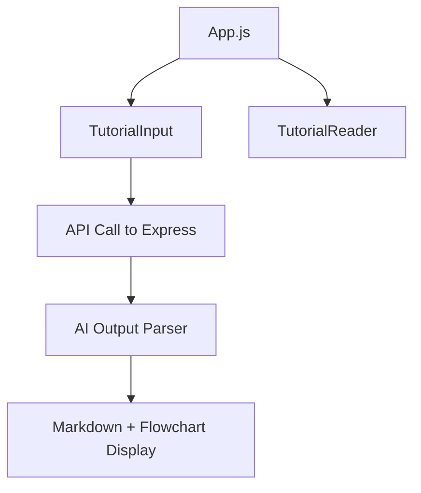

# 📘 GitTutorial - Convert GitHub Repos into Developer-Friendly Tutorials

[](https://reactjs.org/)
[](https://expressjs.com/)
[](https://vercel.com)

---

## 🔍 Overview

**GitTutorial** is an AI-powered platform that turns any **public GitHub repository** into a clean, structured, and readable **step-by-step tutorial**. Perfect for developers who want to **understand unfamiliar codebases**, **learn real-world project structure**, or **create documentation instantly**.

---

## ✨ Features

- 🔗 Paste a GitHub repo link
- 🧠 Uses Ai model to analyze
- 📚 Output:
  - Project Summary
  - Mermaid Flowchart
  - Markdown tutorial with chapters
- 🎨 Beginner-friendly UI with smooth animations
- 🔄 AI fallback system when parsing fails

---

## 📸 Preview

> _Insert image or GIF here showing full flow (input → tutorial display)_

---

## 🧑‍💻 Tech Stack

| Category    | Technology             |
|-------------|------------------------|
| Frontend    | React, Tailwind CSS, Vite |
| Backend     | Node.js, Express.js    |
| AI Inference| Gemni |
| Rendering   | MermaidJS, React-Markdown |
| Deployment  | Vercel (Frontend), Render/Other (Backend) |

---

## 🚀 Getting Started

### 📥 Clone the Repository

```bash
git clone https://github.com/your-username/GitTutorial.git
cd GitTutorial
```

### ⚙️ Setup Environment Variables

#### Backend (`/Backend/.env`)
```env
PORT=5000
Gemni_API_KEY=your_openrouter_api_key
```

#### Frontend (`/Frontend/.env`)
```env
VITE_BACKEND_URL=http://localhost:5000
```

---

### 📦 Install Dependencies

#### Backend
```bash
cd Backend
npm install
```

#### Frontend
```bash
cd ../Frontend
npm install
```

---

### 🏃‍♂️ Run Locally

#### Start Backend
```bash
cd Backend
npm run dev
```

#### Start Frontend
```bash
cd ../Frontend
npm run dev
```

> Visit your app at: [https://git-tutorials.netlify.app](https://git-tutorials.netlify.app)

---

   ```bash
   npm install
   ```
5. Start command:
   ```bash
   npm run dev
   ```

---

## 📘 Example Mermaid Flowchart



---

## 🧩 Project Structure

```
GitTutorial/
├── Backend/
│   ├── index.js
│   ├── fetchGitContant.js
│   └── getTurorialFromRepo.js
├── Frontend/
│   ├── components/
│   ├── pages/
│   ├── App.jsx
│   └── main.jsx
└── README.md
```

---

## 🧠 How It Works

1. User pastes a GitHub repo link.
2. Backend fetches codebase from GitHub.
3. Converts repo to structured JSON format.
4. Sends JSON to Gemni AI.
5. AI returns:
   - Project Summary
   - Mermaid Flowchart
   - Chapter-wise Markdown
6. Frontend renders the tutorial in readable UI.

---

## 🧪 Fallback System

When AI fails to parse or the repo is too complex:
- A lightweight parser attempts minimal tutorial generation.
- A friendly error message is shown to users.
- No app crash due to error handling.

---

## 🤯 Challenges I Faced

| Issue | Solution |
|-------|----------|
| CORS & .env Issues | Used proxy + Vite config |
| Large Repos | Added recursive directory parser |
| AI Output Unstructured | Created schema + fallback parser |
| UI Flickering | Used loading state control component |

---

## 📚 What I Learned

- Parsing GitHub codebase programmatically
- How to use AI-generated structured outputs
- Full-stack app deployment
- Clean UI practices with Tailwind and Vite

---

## 🧑‍🏫 Use Cases

- ✅ Beginner-friendly understanding of complex projects
- ✅ Teachers explaining codebase structure
- ✅ Open-source maintainers writing documentation
- ✅ Devs exploring new repos or onboarding

---

## 📈 Future Improvements

- [ ] Add login with GitHub for private repo support
- [ ] Customize AI prompt per user
- [ ] Export tutorials to Notion/PDF
- [ ] Add light/dark theme toggle
- [ ] Show file-level breakdown for each chapter

---

## 🙋‍♂️ Author

Made with ❤️ by **Abhiraj Kumar**  
📬 [Email](mailto:royabhi2406@gmail.com.com)  
🔗 [LinkedIn](https://www.linkedin.com/in/abhiraj01)

---

## 🔗 Live Website

```txt
🌐 https://git-tutorials.netlify.app
```

---

## ⭐️ Support

If you liked this project, leave a ⭐️ on [GitHub](https://github.com/your-username/GitTutorial) and connect with me!
